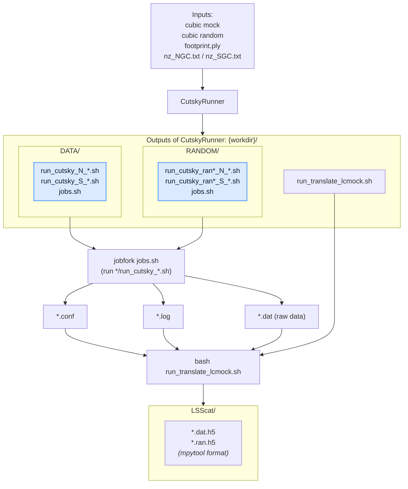

# Mock Module

## Scope
- Tools to generate mock galaxy catalogs.
- Includes cut-sky/lightcone construction from periodic simulation boxes.

## Layout

- `lsslab.mock.__init__`: package entrypoint; exports cutsky submodule
- `lsslab.mock.cutsky`: core routines to turn box catalogs into lightcone mocks
    - `inputs.py`: typed input models for cubic mock and random workflows
  - `nz.py`: N(z) file transformation
  - `normalize.py`: galactic-cap normalization and workdir path resolution
  - `config.py`: configuration rendering
  - `script.py`: shell script generation
    - `runner.py`: `CutskyRunner` orchestrator built on input dataclasses
  - `random.py`: backward-compatible import path for random box utilities
  - `translator.py`: merge raw cutsky outputs and write final LSScat catalogs
    - `utils.py`: cutsky ASCII readers and random-box validation helpers

## Cutsky Runner Workflow

Generates light-cone mock catalogs using the external [cutsky](https://github.com/cheng-zhao/cutsky) binary.



Directory convention:
- `workdir/DATA/`: data-side scripts, prepared cutsky inputs, config files, logs, and raw cutsky `.dat` outputs
- `workdir/RANDOM/`: random box catalogs, random-side scripts, config files, logs, and raw random cutsky `.dat` outputs
- `workdir/LSScat/`: translated final catalogs after post-processing

**Features**:
- Multi-galactic-cap support (NGC, SGC)
- Typed input models for cubic mock and random workflows
- N(z) file transformation and validation
- Automatic shell script generation
- Random-box sufficiency check from an existing random directory

Input model:
- `CubicMockInput(box_path, boxL, zmin, zmax)` manages the data-side cubic mock input.
- `CubicRandomInput(random_dir, boxL, nsample, random_file_scale, nfiles)` manages random-box selection.
- `CutskyInputs(mock, random, footprint_path, nz_path={"N": path_n, "S": path_s})` bundles the full runner input.

Random-box selection/validation in `CutskyRunner.runner_for_random(...)`:
- The runner no longer generates random boxes automatically.
- It scans `random_dir` via `collect_random_box_summary(...)`.
- The per-region validation is delegated to `utils.validate_random_box_catalogs(...)`.
- For the requested random configuration, two checks are required:
    1. Density check: `sum(selected_file.number_density) > required_density * nfiles`
    2. Count check: number of matching files `>= nfiles`
- Here `target_num` comes directly from `nsample` (scalar or per-region dict).
- `random_file_scale` only affects random-side n(z) scaling in `prepare_nz()`.
- If any check fails, the random-box summary is printed and the workflow stops with an explanatory error. Density failures include suggested `N_min`.
- If both checks pass, the workflow continues and reports the selected random box files.

Recommended random-catalog workflow:
- Use the same n(z) for data and random catalogs.
- Prepare random boxes in advance under `random_dir`.
- Choose `random_file_scale` and `nfiles` so the density threshold is satisfied and enough seeds exist.

**Quick Start**: See `examples/cutsky_runner_demo.py` for a complete working example.

### High-Level Workflow

Use `CutskyRunner` methods in sequence to generate the full script set:

```python
from pathlib import Path

from lsslab.mock.cutsky import (
    CutskyInputs,
    CubicMockInput,
    CubicRandomInput,
    CutskyRunner,
)

runner = CutskyRunner(
    workdir=Path("outputs"),
    inputs=CutskyInputs(
        mock=CubicMockInput(
            box_path=Path("box.dat"),
            boxL=6000.0,
            zmin=0.8,
            zmax=1.1,
        ),
        random=CubicRandomInput(
            random_dir=Path("outputs/RANDOM"),
            boxL=6000.0,
            nsample={"N": 230000000, "S": 150000000},
            random_file_scale=1.0,
            nfiles=10,
        ),
        footprint_path=Path("footprint.ply"),
        nz_path={"N": Path("nz_N.txt"), "S": Path("nz_S.txt")},
    ),
)

runner.prepare_nz()
data_scripts, data_jobs = runner.runner_for_mock(rewrite_cat=True)
selected_random_boxes, random_scripts, random_jobs = runner.runner_for_random()
translate_script = runner.generate_translation(tracer="LRG", with_randoms=True)
```

This produces:
- DATA-side scripts and optional jobs file
- Selected random box files, RANDOM-side scripts, and optional jobs file
- A translation script for post-processing

For a focused cutsky-only guide, see `docs/mock/cutsky.md`.
